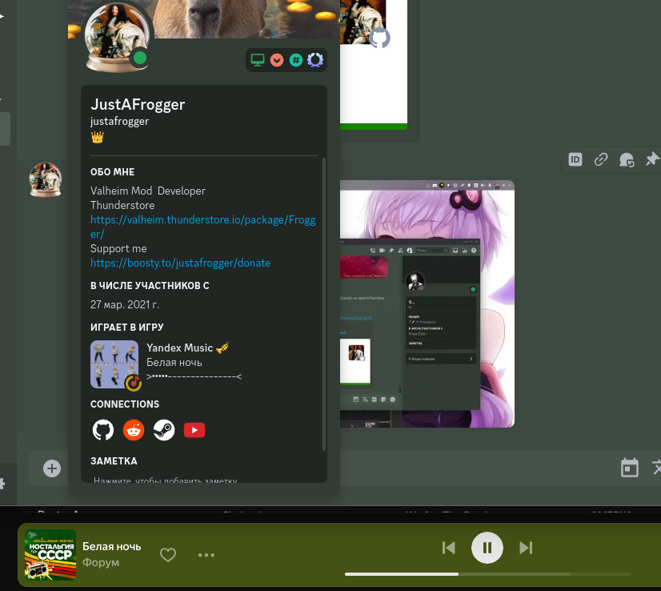

# YandexMusicDiscordRpc

Отображает в дискорде трек и плейер из десктопного приложения Яндекс.Музыка.  
Протестировано на ArchLinux с [yandex-music-linux](https://aur.archlinux.org/packages/yandex-music)

Оно работает!...ну как минимум у меня.

За основу были взяты эти проекты:
* [music-rpc](https://github.com/bramtechs/music-rpc)
* [YoutubeMusicDiscordRPC](https://github.getafreenode.com/ludals/YoutubeMusicDiscordRPC)

Работает без каких либо токенов, но при знаии и желании можно указать токен яндекс.музыки в конфиге.

Конфиг в файле `cfg.py`

На данный момент поиск может иметь неточности 
